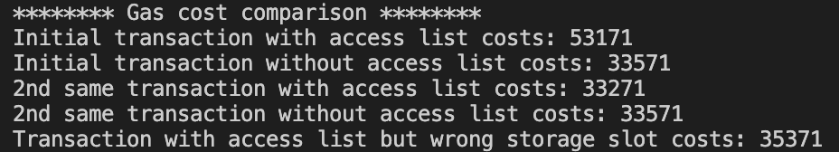

# EIP-2930 - Access Lists

EIP-2930 introduces access lists to optimize gas costs for transactions that access storage across multiple contracts.

## Background

When a transaction calls another contract, it must pay gas to load and check the state of that contract. Accessing storage slots also costs gas.

EIP-2930 allows a transaction to specify an "access list" - the contract addresses and storage slots it will read.

This allows the EVM to only load the required state, skipping unused data.

## How Access Lists Work

An access list contains:

- Addresses of contracts called externally
- Specific storage slots read from those contracts

For example:

```solidity
// Contract A
function foo() {
  // Call contract B
  B.doSomething()

  // Read storage slot 1 in B
  B.slot1();
}
```

The access list for `A.foo()` would be:

```
[
  {
    "address": "0x1234...B", // B's address
    "storageKeys": [
      "0x0000000000000000000000000000000000000001" // slot 1
    ]
  }
]
```

When the EVM processes the transaction, it will:

- Pre-load address B as "warm"
- Pre-load slot 1 as "warm" in B

Storage slots not in the access list are left "cold".

## Gas Savings

Although Access lists incurs an increased intrinsic cost for the transaction, but provides discounts for storage and state access throughout the execution of the transaction.

Access lists let transactions pre-pay the cost for loading storage slots.

- Warm reads are 100 gas
- Cold reads are 1900 gas

Cross-contract calls also get a discount from 2600 to 2400 gas.

Gas cost comparison based on this project implementation :


## Example Code

Here is example JS code to create a transaction with an access list:

```js
let tx = {
  type: 1, // Access list transaction
  accessList: [...],
  to: "0x123",
  ...
}
```

The access list is provided to web3.js/ethers as part of the transaction.

## Conclusion

Access lists optimize gas costs when transactions access predictable storage across multiple contracts. By pre-declaring the addresses and slots you need, gas savings are possible.

## Note

If there are no cross-contract calls or if storage slots are unknown, then using access is no-brainer as it in turn cost more gas if accessed wrong storage slot.
